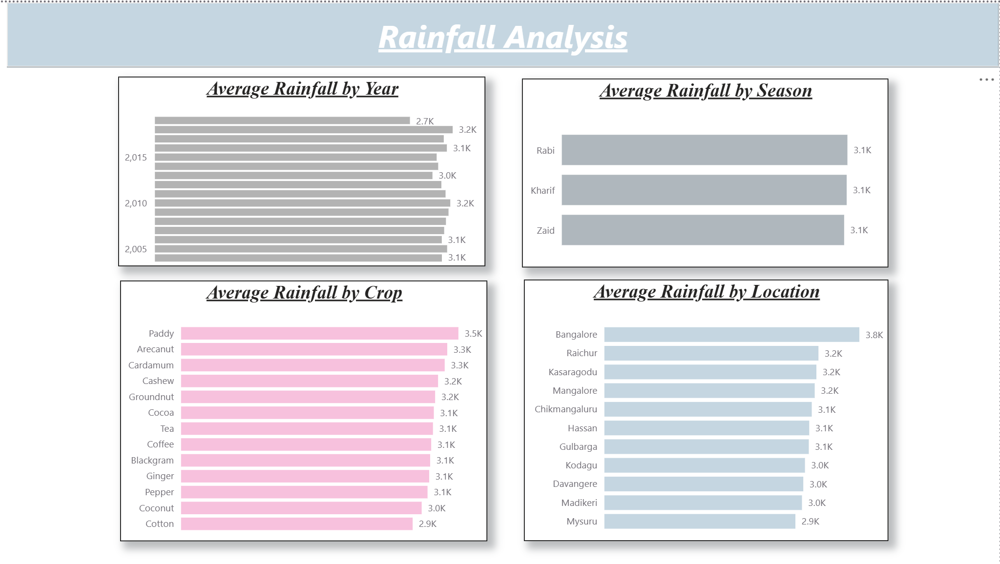
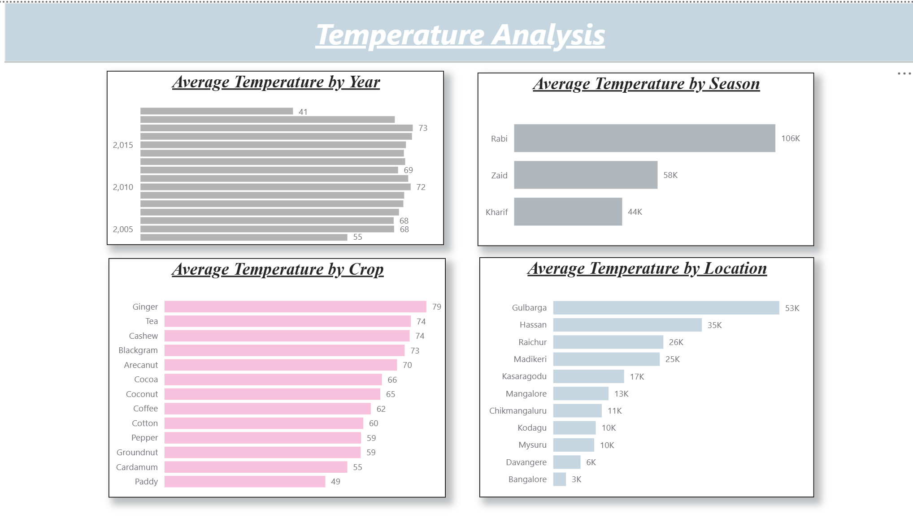
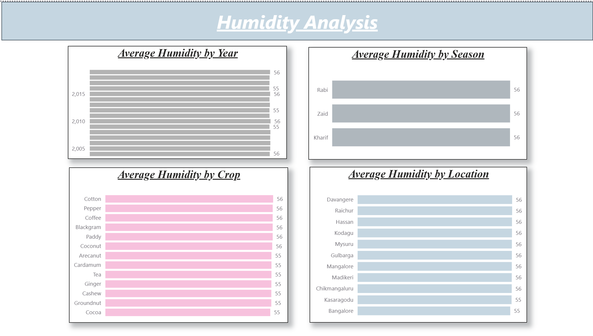
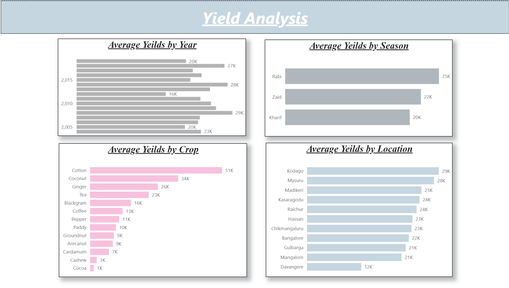

# Seasonal Crop Yield Analytics Pipeline using AWS, Snowflake & Power BI

> An end-to-end cloud-based data analytics project demonstrating data ingestion, warehousing, transformation, and interactive business intelligence using **Amazon S3**, **Snowflake**, **SQL**, and **Power BI**.


---

# Project Overview

Agricultural productivity is influenced by multiple environmental and operational factors such as rainfall, temperature, humidity, irrigation methods, soil characteristics, and seasonal variation. This project demonstrates how modern cloud analytics technologies can be integrated to transform raw agricultural data into actionable business insights.

The solution follows an end-to-end analytics workflow, beginning with data storage in Amazon S3, ingestion into Snowflake through a secure storage integration, SQL-based data transformation and modelling, and finally visualization through interactive Power BI dashboards.

This is my very first project simulates a real-world analytics pipeline outside translational data commonly used in enterprise data platforms.

---

# Objectives

- Design a cloud-native data analytics pipeline.
- Store raw datasets in Amazon S3.
- Integrate Snowflake with AWS using Storage Integration.
- Load and transform agricultural data using SQL.
- Build an interactive Power BI dashboard.
- Generate insights supporting data-driven agricultural decision making.

---

# Solution Architecture

```text
                    Raw CSV Dataset
                           │
                           ▼
                    Amazon S3 Bucket
                           │
                           ▼
           Snowflake Storage Integration
                           │
                           ▼
                 External Stage (S3)
                           │
                           ▼
                Snowflake Data Warehouse
                           │
                           ▼
                SQL Data Transformation
                           │
                           ▼
                 Power BI Semantic Model
                           │
                           ▼
              Interactive Business Dashboard
```

---

# Technology Stack

| Category | Technology |
|-----------|------------|
| Cloud Storage | Amazon S3 |
| Cloud Data Warehouse | Snowflake |
| Query Language | SQL |
| Data Transformation | Snowflake SQL |
| Business Intelligence | Power BI |
| Data Modeling | Power BI |
| Version Control | Git |
| Repository | GitHub |

---

# Repository Structure

```
Seasonal-Crop-Yield-Analytics/
│
├── README.md
│
├── data/
│   └── season.csv
│
├── sql/
│   ├── 01_storage_integration.sql
│   ├── 02_create_table.sql
│
├── powerbi/
│   └── season.pbix
│
├── images/
│   ├── rainfall_analysis.png
│   ├── temperature_analysis.png
│   ├── humidity_analysis.png
│   └── yield_analysis.png
│
└── docs/
    └── Report.pdf
```

---

# Data Pipeline

## 1. Data Collection

The agricultural dataset contains seasonal information including:

- Temperature
- Rainfall
- Humidity
- Soil Type
- Irrigation Method
- Crop Type
- Crop Price
- Season
- Year Group

---

## 2. Data Storage

The raw CSV dataset is stored securely in an Amazon S3 bucket.

---

## 3. Snowflake Storage Integration

A Snowflake Storage Integration was configured to establish secure access between Snowflake and Amazon S3 using IAM roles.

---

## 4. External Stage

An external stage was created to reference the S3 bucket and enable cloud-native data ingestion.

---

## 5. Data Loading

The dataset was imported into Snowflake using the `COPY INTO` command.

---

## 6. Data Transformation

SQL scripts were used to:

- Validate imported records
- Standardize categorical variables
- Remove inconsistencies
- Prepare analytical tables
- Create reporting-ready datasets

---

## 7. Business Intelligence

Power BI connects directly to Snowflake to generate interactive dashboards that allow users to explore environmental and agricultural trends.

---

# Dashboard Pages

## Rainfall Analysis

**Purpose**

Analyze rainfall patterns across seasons and evaluate their relationship with crop productivity.

**Visualizations**

- Rainfall Distribution
- Seasonal Rainfall Comparison
- Rainfall by Crop Type

---

## Temperature Analysis

**Purpose**

Study temperature variations and identify optimal growing conditions.

**Visualizations**

- Temperature Distribution
- Seasonal Temperature Trends
- Temperature vs Crop Yield

---

## Humidity Analysis

**Purpose**

Explore humidity levels and their effect on agricultural productivity.

**Visualizations**

- Humidity Distribution
- Seasonal Humidity Comparison
- Humidity by Crop

---

## Yield Analysis

**Purpose**

Evaluate agricultural productivity across different crops, seasons, irrigation methods and soil types.

**Visualizations**

- Crop Yield
- Yield by Season
- Yield by Irrigation
- Yield by Soil Type

---

# Business Questions Addressed

- Which season produces the highest crop yield?
- How does rainfall influence agricultural productivity?
- What temperature range is associated with improved yield?
- Which irrigation method performs best?
- Which soil type supports higher crop productivity?
- How does humidity vary across seasons?

---

# Key Insights

- Environmental variables exhibit distinct seasonal trends that influence agricultural outcomes.
- Crop productivity varies across irrigation methods and soil types.
- Interactive dashboards enable rapid comparison across seasons and crop categories.
- The cloud-based architecture supports scalable analytics and reporting.

---

# Dashboard Preview

---

## Rainfall Analysis



---

## Temperature Analysis



---

## Humidity Analysis



---

## Yield Analysis



---

# Skills Demonstrated

### Cloud Technologies

- Amazon S3
- Snowflake

### Data Engineering

- Cloud Data Warehousing
- Storage Integration
- External Stages
- Data Ingestion
- ETL Pipeline

### SQL

- Data Definition Language (DDL)
- Data Loading
- Data Transformation
- Aggregations
- Business Queries

### Business Intelligence

- Power BI
- Interactive Dashboards
- KPI Design
- Data Storytelling
- Drill-through Analysis
- Filtering & Slicers

### Software Engineering

- Git
- GitHub
- Repository Organization
- Documentation

---

# ▶ How to Run

### Clone Repository

```bash
git clone https://github.com/suvrazastrovision/Seasonal_Analytics.git
```

### Open Power BI

Open

```
powerbi/season.pbix
```

using Power BI Desktop.

If using your own Snowflake instance, update the connection settings and refresh the dataset.

---

# Future Improvements

- Automate ingestion using Snowpipe (?).
- Integrate live weather APIs.
- Add machine learning models for crop yield prediction.
- Schedule automated refreshes.
- Deploy dashboards to Power BI Service.
- Build a Streamlit dashboard for web deployment.
- Containerize the pipeline using Docker.
- Orchestrate workflows using Apache Airflow.

---

# Learning Outcomes

This project strengthened practical experience in:

- Designing cloud-native analytics pipelines.
- Working with cloud data warehouses.
- SQL-based analytical data modeling.
- Building interactive business intelligence dashboards.
- Communicating insights through data visualization.
- Applying enterprise data engineering best practices.

---


---

# ⭐ Acknowledgements

This project was developed by adapting as a hands-on demonstration of modern cloud analytics practices by Udemy/Coursera/Udacity tutorial using Amazon S3, Snowflake, SQL, Power BI and Open-AI. It is intended for educational and portfolio purposes.
